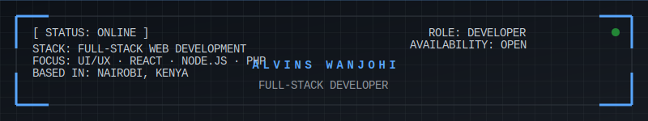

<!-- HEADER HUD -->

  >>_INITIALIZING_QUANTUM_CORE...;>>>_ESTABLISHING_UPLINK...;>>>_WELCOME_TO_THE_NEXT_GEN_INTERFACE;>>>_ALVINS_WANJOHI_CORE_ONLINE&center=true&width=600&height=50&color=58a6ff&font=Courier+New&size=20" alt="System Boot" />

<!-- STATS TERMINAL -->
<table width="100%">
  <tr>
    <td width="33%" align="center">
      
    </td>
    <td width="33%" align="center">
      
    </td>
    <td width="33%" align="center">
      
    </td>
  </tr>
</table>

<!-- SYSTEM MONITORING -->
 

 

## 🖥️ Active Modules

| MODULE_ID | STATUS | CAPABILITY |
| :--- | :--- | :--- |
| **UX_ENGINE** | `[ ONLINE ]` | High-fidelity interfaces with Next.js & Tailwind |
| **LOGIC_CORE** | `[ STABLE ]` | Distributed systems using Node.js & PHP |
| **DATA_CRUNCH** | `[ RUNNING ]` | Advanced analytics with Python & Jupyter |
| **SEC_SHIELD** | `[ ARMED  ]` | Cyber resilience and secure architecture |

 

<!-- PROJECT GRID -->

## 📂 Project Repositories

### 🛡️ Eragon Lexicon
> **Protocol**: `Vocabulary Enhancement`  
> **Status**: `DEPLOYED`  
> **Access**: [WANJOHIALVINS / ERAGON-LEXICON](https://github.com/wanjohialvins/Eragon-Lexicon)  
> *Ignite your vocabulary with this interactive word-smithing tool built for speed and elegance.*

### 🧾 Invoice System
> **Protocol**: `Enterprise Management`  
> **Status**: `OPERATIONAL`  
> **Access**: [WANJOHIALVINS / INVOICE-SYSTEM](https://github.com/wanjohialvins/Invoice-system)  
> *Professional invoice generation & stock management system for scaling business operations.*

### 🌐 Personal Website
> **Protocol**: `Digital Identity`  
> **Status**: `LIVE`  
> **Access**: [WANJOHIALVINS / PERSONAL-WEBSITE](https://github.com/wanjohialvins/Personal-Website)  
> *Sleek portfolio showcasing frontend prowess and state-of-the-art UI design thinking.*

### 🎮 Valorant Trivia
> **Protocol**: `Gaming Intelligence`  
> **Status**: `ACTIVE`  
> **Access**: [WANJOHIALVINS / VALORANT-TRIVIA-CLI](https://github.com/wanjohialvins/valorant-trivia-cli)  
> *CLI-based trivia game providing the ultimate challenge for tactical shooter enthusiasts.*

 

<b>[ VIEW_ADDITIONAL_PROTOCOLS ]</b>

 

- **Forthall Appointment**: Patient-centric healthcare management.
- **Graduation Invite**: Animated event coordination portal.
- **YEMOJI**: Interactive emoji sharing experience.
- **Sounds of Alagaesia**: Creative audio synthesis.
- **Valorant Analysis**: Statistical performance visualization.

 

## 🚀 Tech Arsenal

  &nbsp;
  &nbsp;
  &nbsp;
  &nbsp;
  &nbsp;
  &nbsp;
  &nbsp;
  

 

## 🌐 Uplink Channels

  &nbsp;&nbsp;
  &nbsp;&nbsp;
  

  <b>ALVINS_WANJOHI_CORE_TERMINAL // VERSION_5.1.0 // LAST_UPDT: <!--DATE-->2026-01-03<!--ENDDATE--></b>

